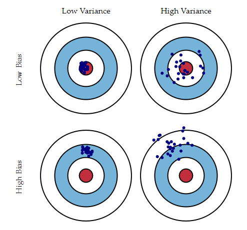

# Module1
## Module1.1 Introduction
#### [주간 질문] AI를 통해 Finance의 어떤 문제들을 해결할 수 있을까요? 

    1. Increasing security: security와 관련된 빅데이터 분석을 통한 보안 향상. (Anti-Money Laundering, fraud detection 등등)
    2. Reducing processing times: financial documentation 처리에 걸리는 시간을 줄여주는 효과.
    3. Algorithmic trading:trading pattern을 찾고, trends를 예측하기 위하여 AI를 적용시켜서, 더 성공적인 stock trading decisions을 내리도록 함.
    4. Customer recommendation / Credit lending: consumer data, financial lending 혹은 insurance results등의 자료를 기반으로, 고객들의 관심분야를 추천에서부터, 대출 여부를 평가하는 등의 분야에도 적용 가능함.
    5. Porfolio Management
    
## Module1.2 Machine Learning for Financial Time Series Prediction
#### [주간 질문] Deep Learning Predictor를 이용한 방법은 Traditional Predictors에 비해 어떤 이점이 있을까요?

    1. casual model보다 예측에 더 나은 성능을 보인다. 
    2. 관련이 있는 모든 데이터들을 포함하도록 input data를 확장시킬 수 있다. 
    3. 선형모델만으로는 표현할 수 없는 것들을 머신러닝은 비선형으로 표현할 수 있음 
    4. over-fitting 문제를 쉽게 피할 수 있음. (Cross validation, Dropout for model selection, Regularization techniques등을 통해)
    5. 가장 좋은 모델을 만들기 위해 머신러닝은 자동적으로 feature를 선택할 수 있다.

#### Question1. 인과추론과 예측의 차이를 예를 들어 설명해주세요. 편향없는 추정과 가장 유사한 상관관계는 어떻게 다른가요

    해당 자료를 통해서 말하고 싶은 바는, Machine Learning이 어떤 문제를 효과적으로 풀 수 있고, 어떤 문제에는 효과적이지 않은지에 대해 다루고 싶었습니다. 
    이는 곧 Financial Time Series Prediction에 있어서 주의해야 할 점이여서 강의 초반부에 집고 넘어가고 싶었고요.

    핵심만을 요약드리지면, Machine Learning을 통해서는 Prediction 문제를 효과적으로 풀 수 있는 반면에 Causation에 대한 주장은 할 수 없습니다. 
    이론적인 배경 없이 어떠한 Factor가 어떠한 결과를 야기했다고 볼 수 없기 떄문에, 이러한 예측은 잘 못된 결과를 만들어 낼 수 있습니다.

    조금 더 구체적으로, Prediction과 Causation의 차이를 단적으로 예를 들면, 만약 전자레인지 폭발에 의해 불이나 난 상황에서 
        1. Causation: 불이 일어난 원인은 전자레인지 폭발에 의한 것입니다. 
        2. Correlation: 소방관이 몰려 있는 곳에는 불이 났을 수 있습니다. 하지만, 소방관이 불을 일으키진 않았고, 
                        둘 사이에는 상관관계가 높을 뿐 입니다. 
        3. Prediction: 하지만 소방관이 몰려있다는 것으로 부터, 불이 났을 거라는 예측을 할 수는 있습니다.

    따라서, Prediction에 있어서는 Causation과 관련 없이 Correlation이 중요 합니다. 
    하지만, 만약 소방관이 몰려 있는 것이 불을 일으킨다고 잘 못 해석을 하면, 치명적인 예측 오류를 범하게 됩니다. 

    Prediction과 Causation은 목표로 하는 역할이 다르며, 저희가 Machine Learning을 통해 풀고자 하는 문제의 목표는 Prediction Level을 높히기 위함입니다. 
    따라서, 이에 따른 단점 (인과성 부족, 이론 부족)을 인지하신 뒤에, 일반적인 인과 관계 추론 모형 (Regression)보다 어떤 점이 더 나을 수 있는지 (비선형성, Over fitting 문제를 더 쉽게 다를 수 있음 등)를 숙지하셨으면 합니다.

#### Question2. 6-10 Page 및 7,8 Page 수식에 대한 추가 설명

    1. 6 page
        - Explanation 모형과 Prediction 모형에 있어서 4가지 큰 차이점을 볼 수 있습니다.
        - Theory – Data
            - Explanation 모형은 Theory에 기반하여 예측 모형의 형태를 신중하게 설정합니다. 예를 들어 선형 관계이면 왜 선형관계인지, Curve Linear 관계를 지니면 왜 그런지에 대해서 다루며, 입력 데이터와 출력 데이터 사이의 관계가 중요합니다.
            - Prediction 모델에서는 예측 함수의 형태는 데이터로 부터 나오며, 입력 데이터와 출력 데이터 사이의 관계는 중요하지 않습니다.
        - Causation – Association
            - Explanation Model에서는 X가 Y를 Cause합니다
            - Prediction Model에서는 X가 Y와 Correlation이 있습니다.
        - Bias – Variance
            - Explanation 모형에서는 Bias를 최소화한 Factor (Causual Effect)를 찾는 문제를 풀지만
            - Prediction에서는 Bias와 Variance의 합을 최소화 하는 모형을 찾습니다.
        - Retrospective (in-sample) – Prospective (out-of-sample)
            - Predictive modeling은 forward-looking을 목적으로 하는 반면에
            - Explanation 모형은 이미 세워진 가설 관계를 검증하는 용도로 사용합니다.

    2. 7 page
        - Bias: Bias is the result of misspecifying the statistical model f.
        - Variance: Estimation variance (the third term) is the result of using a sample to estimate f.

        - The first term is the error that results even if the model is correctly specified and accurately estimated
        - The above decomposition reveals a source of the difference between explanatory and predictive modeling:
            - In explanatory modeling the focus is on minimizing bias to obtain the most accurate representation of the underlying theory. 
            - In contrast, predictive modeling seeks to minimize the combination of bias and estimation variance, occasionally sacrificing theoretical accuracy for improved empirical precision

    3. 8 page
        - Causual Inference는 Unbiased estimates를 목표로 합니다.
        - 이를 검증하기 위해서, 연구 대상 A가 factor X에 영향을 받았을 때와 받지 않았을 때의 차이를 보고 싶은데,
        - Observational Data (실험이 아닌)에 기반하면 사실은 연구 대상 A가 factor X에 영향을 받았을 때와,
        - X에 노출 된적 없었던 그룹 연구 대상 B가 factor X에 영향을 받지 않았을 때의 차이를 보게 됩니다.
        - 완전히 동일한 연구 대상에 2개의 다른 Treatment를 가할 수가 없습니다.
            - A -> Treatment -> A'
            - Note. we can not observe (A -> No Treatment -> A'') (시간이 지나면서 A도 Treatmnet가 아닌 다른 무언가에 영향을 받음)            
            - What we want to see: factor x => (A'-A'')

            - However, what we actually compare
            - B -> No Treatment -> B'(?) (시간이 지나면서 B도 뭔가 바뀜)
            - Then, we observe factor x => (A'-B') - (A-B)

    4. 9 page
        - Prediction은 Out of sample에서의 High Predictive Power를 목표로 합니다.
            - 이를 통해서 모든 Correlation을 고려하여 Bias를 줄이며,
            - 동시에 Overfitting 문제를 다루어 Variance를 최소화 합니다.

    5. 10 page
        - 따라서 Prediction 모델과, Causation 모델은 다른 두가지 목적으로 사용됩니다.
            - 어떠한 Factor X가 정말로 Outcome Y에 영향을 미쳤는지를 Causual하게 알고 싶으면,
            - Causation 모형을 사용하여야 하고
            - 예측률이 높은 모형을 만들고 싶으면 Prediction 모형을 쓰면 됩니다.

#### Question3. unbiased estimate란?
    
    unbiased estimator란 모델 추정량의 평균이 실제 모수값과 일치할 때를 뜻합니다.

        An estimator is said to be unbiased if its bias is equal to zero for all values of parameter θ. (https://en.wikipedia.org/wiki/Bias_of_an_estimator)
    
    아래의 자료의 그림 "Graphical illustration of bias and variance" 을 보시면, Low Bias에 대한 이해가 분명해 지실 것 같습니다.
    

    (http://scott.fortmann-roe.com/docs/BiasVariance.html)

## Module1.5 Tensorflow Keras API on Google Colab
#### Question1. 모델 만드는 법에 대해서 더 배우고 싶어요. 있는 코드 따라하는거야 문제 없는데 새로운 모델을 만들라고 하면 코드를 전혀 생각해 낼수 없을것 같습니다.

    큰 Process (Data Preprocessing -> Model Build -> Model Compile -> Model Train -> Prediction) 를 항상 기억하시고,
    예제 문제들에 대해 Solution을 바로 보기 보다는 어렵지만 먼저 풀어보시는 시도를 하시면 도움이 많이 되는 것 같습니다.

    예제 문제를 가급적 많이 만들어보고 싶지만, 한달의 시간이 생각보다 더 Tight 한 것 같습니다. 이와 관련하여서는 직접 연습해 보실 수 있는 자료를 따로 정리하여 공유드리겠습니다.
    
#### Question2. 은닉 레이어의 출력 값이 정해지는 기준( (tf.keras.layers.Dense(128, activation=tf.nn.relu) ) 시에 128이 정해지는 기준,  영상에서 레이어 한개는 뉴럴 네트워크 두개이상 딥 뉴럴 네트워크라고 설명을 했는데 같은값으로 은닉 레이어를 두개 만들었는데( model.add(tf.keras.layers.Dense(128, activation=tf.nn.relu))  model.add(tf.keras.layers.Dense(128, activation=tf.nn.relu)) ) 이렇게 할 시 한 개와 어떤 차이점이 있는지. Overfitting과 레이어 갯수의 결정 사이에 대한 연관성.

    레이어 수와 크기 설정의 문제에 있어서 사용할 아키텍처를 어떻게 결정할까요?
    Hidden Layer를 쓰는게 좋을지, 하나의 Hidden Layer를 쓸지, 두 개의 Hidden Layer를 쓸지, 각 층은 얼마나 커야하는지에 대한 고민이 있을 수 있습니다.
    
    간략히 답을 드리자면, 첫째로, 신경망의 크기와 수를 증가 시키면 네트워크의 표현력(Capacity)이 증가한다는 점에 유의하시면 됩니다.
    즉, 뉴런이 많을 수록 표현 가능한 공간이 커집니다.

    예를 들어, 2차원에서 아래와 같은 2진 분류 문제가 있다고 가정하면, 아래 3개의 신경망(모두 하나의 층만 있음)은 Node의 개수를 달리 했을 때의 결과를 보여 줍니다.

    위의 다이어그램에서 뉴런이 더 많은 네트워크는 더 복잡한 기능을 표현할 수 있지만, 이 결과는 blessing과 (더 복잡한 데이터를 분류하는 것을 배울 수 있기 때문에)과 Curse입니다 (훈련 데이터를 Overfitting 하기 쉽기 때문에). 
    복잡한 모형보다, 3개의 hidden neuron을 가진 모델이 전체 데이터를 큰 두가지 모양으로 구분하고 나머지 점들은 noise로 해석하는데, 더 나은 일반화를 한 모델일 수 있습니다.

    추가적으로, 128이라는 숫자는 사실 Convention에 가까운 것 같습니다. 직접 테스트 해보지는 못 했지만, 32의 배수가 GPU가 메모리에서 다루기가 편하며, 속도적인 이점이 있다고도 합니다.

    참고: http://cs231n.github.io/neural-networks-1/
