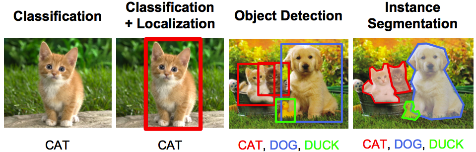
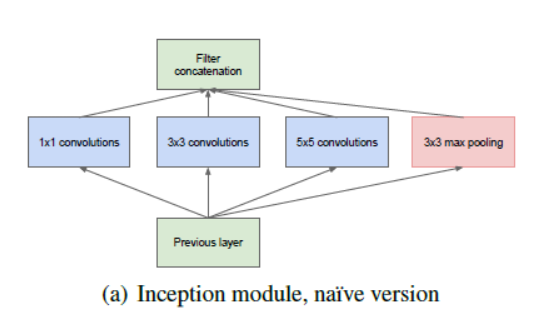
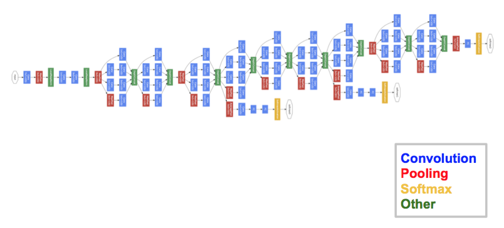
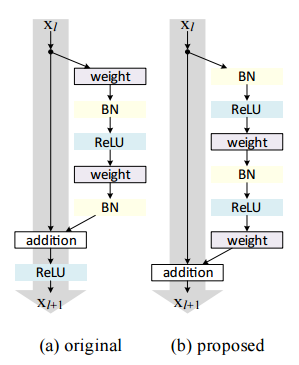
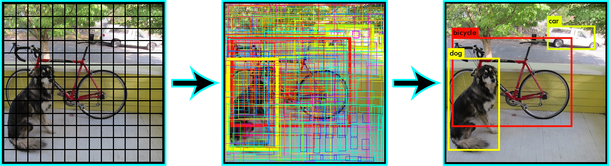

# For Computer Vision Task

    1. Classification: 
        - GoogleNet
        GoogleNet (or Inception Network) is a class of architecture designed by researchers at Google. 
        GoogleNet was the winner of ImageNet 2014, where it proved to be a powerful model. 
        In this architecture, along with going deeper (it contains 22 layers in comparison to VGG which had 19 layers), 
        the researchers also made a novel approach called the Inception module. 
        The final architecture contains multiple of these inception modules stacked one over the other.

    2. Object Detection
        - ResNeXt
        ResNeXt is said to be the current state-of-the-art technique for object recognition. 
        It builds upon the concepts of inception and resnet to bring about a new and improved architecture. 

        - YOLO (You Only Look Once)
        YOLO is the current state-of-the-art real time system built on deep learning for solving image detection problems. 
        As seen in the below given image, it first divides the image into defined bounding boxes, 
        and then runs a recognition algorithm in parallel for all of these boxes to identify which object class do they belong to. 
        After identifying this classes, it goes on to merging these boxes intelligently to form an optimal bounding box around the objects.

    3. Instance Segmentation
        - SegNet
        SegNet is a deep learning architecture applied to solve image segmentation problem. 
        It consists of sequence of processing layers (encoders) followed by a corresponding set of decoders for a pixelwise classification. 

    4. Other Tasks
        - Visual Reasoning (LSTM, CNN, RN Combinations)
        - OCR: Google Maps and Street View (CNN, RNN Combinations)
        - Teaching Machine to Draw (SketchRNN)

