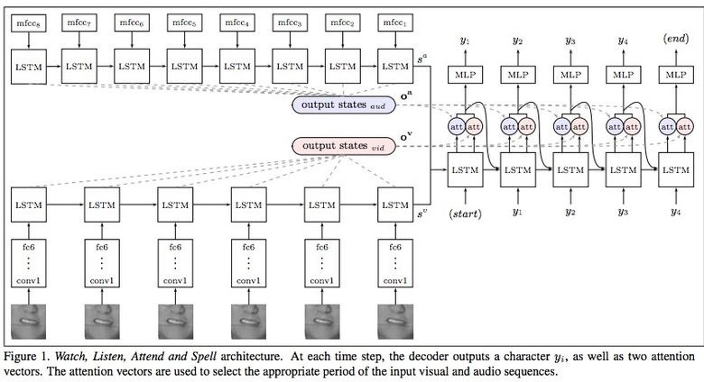
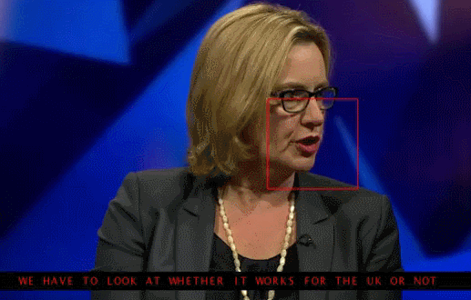
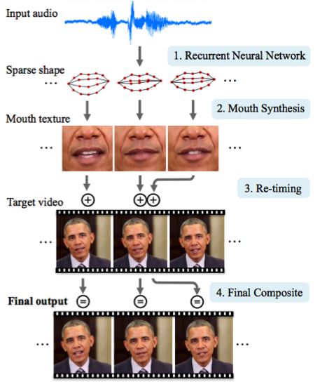

# For Voice Related Task
    1. Speech Recognition

    2. Generation of Voice
        - WaveNet(A generative model for raw audio)
        researchers made an autoregressive full-convolution WaveNet model based on previous approaches to image generation (PixelRNN and PixelCNN). 
        The network was trained end-to-end: text for the input, audio for the output. 

    3. Lip Reading
        - “omnichannel” model (audio + video)
        There are 100,000 sentences with audio and video in the dataset. Model: LSTM on audio, and CNN + LSTM on video. 
        These two state vectors are fed to the final LSTM, which generates the result (characters).
    
    

    4. Lip Sync from Audio
        - Combination of models
        1. RNN 2. Mouth Syntyhesis 3. Re-timing 4. Composite 

    
